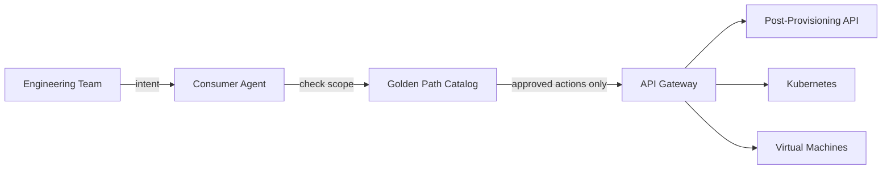
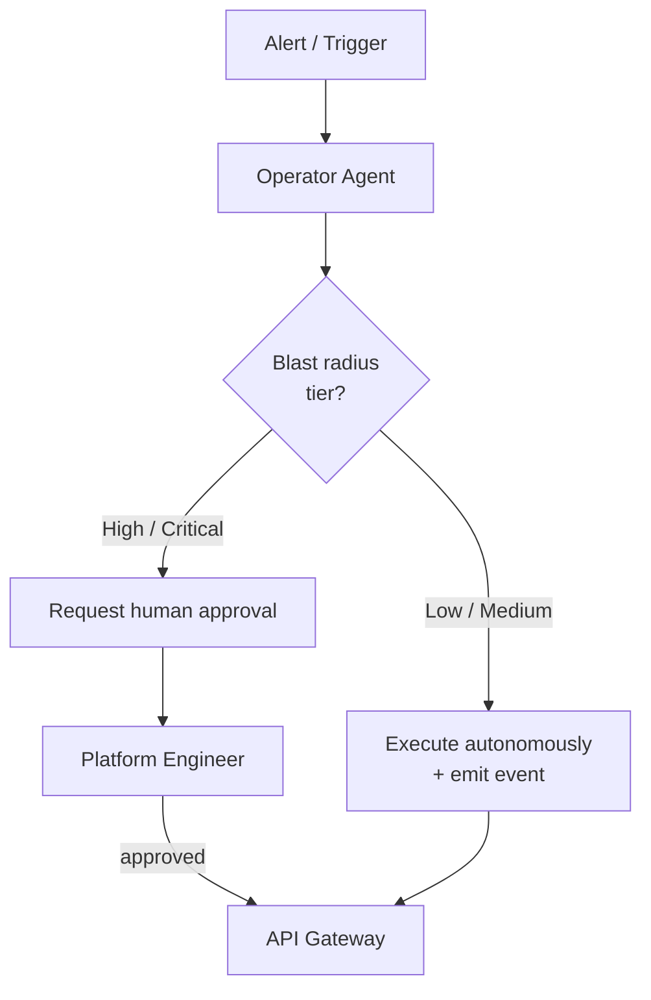
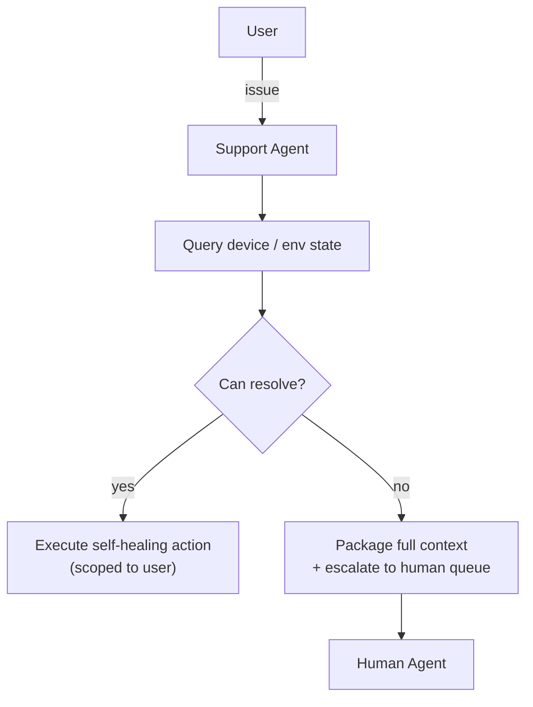

# Agentic Platform Access — Agent Archetypes

Agents operating on this platform are not one thing. There are three distinct archetypes, each with different scope, trust level, and governance requirements. The archetype determines what the agent can do, what it cannot do, and what the key governance question is for every action it takes.

---

## 1. Consumer Agent

**Who it serves:** Engineering teams consuming the platform — requesting VMs, Kubernetes clusters, software installations, running post-provisioning jobs.

**What it can do:**
- Provision resources within approved quotas and configurations
- Rerun post-provisioning jobs
- Install software from the approved catalog
- Query the status of their own resources
- Follow golden paths defined by platform engineering

**What it cannot do:**
- Touch resources owned by another team
- Install software not in the approved catalog
- Modify infrastructure configuration
- Bypass quota or policy controls

**The model:** the consumer agent is a constrained interface. It translates a team's intent into API calls, but only within the scope of what has been approved for that team. The golden path is not a suggestion — it is the boundary of what the agent is permitted to execute.

**The key governance question:** is this team's agent acting within their authorized scope, on their own resources, using approved software? Everything else is denied.

---

## 2. Platform Operator Agent

**Who it serves:** Platform engineering — the team that builds and operates the infrastructure.

**What it can do:**
- Respond to alerts and degraded system states
- Diagnose node, VM, and network issues
- Trigger remediation actions (restart services, drain nodes, reroute traffic)
- Execute runbooks automatically for known failure patterns
- Update configurations across the stack

**What it cannot do:** act autonomously at high blast radius without a human in the loop.

**The model:** the platform operator agent is high-trust and high-consequence. It can move fast on low-blast-radius actions (restart a service, drain a node). It must pause and require human approval for high-blast-radius actions — anything that affects multiple teams, production-class resources, or is irreversible.

**The key governance question:** what is the blast radius of this action, and does it require a human approval gate?

The threshold for human-in-the-loop is not just about risk level — it is also about reversibility. An agent that can make a change and undo it quickly if wrong is lower risk than one making permanent changes, even if the immediate blast radius looks similar.

---

## 3. Support Agent

**Who it serves:** Any user with a device, a broken environment, or a question that would previously have generated a ticket.

**What it can do:**
- Query the state of a user's device or environment
- Attempt known self-healing actions (reinstall an agent, reconfigure a network profile, rotate a credential)
- Escalate to a human with full context already attached — no more "please describe your issue" after a 30-minute diagnosis

**What it cannot do:**
- Make changes to infrastructure outside the requesting user's scope
- Access another user's device or data
- Escalate silently — every escalation includes a full context record

**The model:** the support agent replaces the intake and triage layer of traditional ticketing, not the resolution layer. Its job is to resolve what it can, and to hand off everything else with the context a human needs to close it in one touch.

**The key governance question:** is the action scoped to this user's own environment, and is there a human fallback with full context when the agent cannot resolve it?

---

## Archetype Comparison

| | Consumer Agent | Operator Agent | Support Agent |
|---|---|---|---|
| **Serves** | Engineering teams | Platform engineering | End users |
| **Trust level** | Constrained | High-trust, gated | Scoped to user |
| **Autonomous authority** | Within golden path | Low/Medium blast radius | Known self-healing only |
| **Human gate trigger** | Out-of-catalog request | High/Critical blast radius | Cannot resolve |
| **Key input** | Team intent | Alerts and degraded state | User issue report |
| **Key output** | Resource provisioned | System remediated | Issue resolved or escalated with context |
