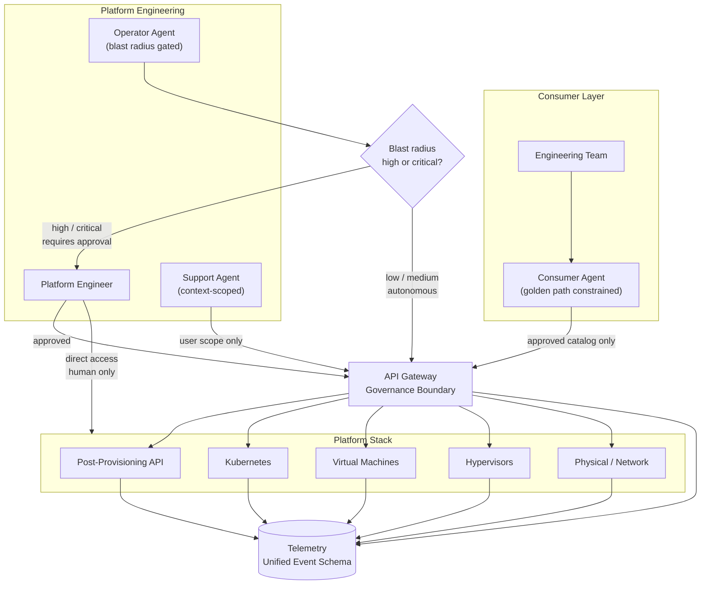

# Agentic Platform Access — Overview

AI agents are not just tools teams build with. They are becoming operators — entities that provision infrastructure, respond to alerts, install software, and support users. The platform has to be designed for this, not retrofitted to it.

This section maps out how agents access and operate across a private cloud platform stack — from consumer-facing golden paths down to hypervisors and physical network.

---

## The Documents

| Document | What it covers |
| --- | --- |
| [Prerequisites](./prerequisites.md) | The 10 things that must exist before any agent operates safely |
| [Agent Archetypes](./archetypes.md) | Consumer, Operator, and Support agents — scope, authority, and governance per archetype |
| [Identity and Authorization](./identity-and-authorization.md) | Credential model, Least Privilege vs. Least Agency, policy-as-code enforcement |
| [Threat Model](./threat-model.md) | Prompt injection, blast radius, OWASP and CISA guidance |
| [Telemetry](./telemetry.md) | Unified event schema, what each layer emits, agent action log |
| [Governance](./governance.md) | Who owns what, the decision model, exception process, and how the model evolves |
| [Build Sequence](./build-sequence.md) | What to build first, possible solution shapes |

---

## The Stack

The platform is not one thing. It is a set of distinct layers, each with different operators, different blast radii, and different governance requirements.

```
┌─────────────────────────────────────────────────────┐
│               Consumer-facing layer                 │
│   Teams consuming VMs, Kubernetes, software         │
├─────────────────────────────────────────────────────┤
│            Post-provisioning / API layer            │
│   Software installation, job execution, golden paths│
├─────────────────────────────────────────────────────┤
│              Kubernetes / workload layer            │
│   Cluster management, workload scheduling           │
├─────────────────────────────────────────────────────┤
│               Virtual machine layer                 │
│   VM lifecycle, resource allocation                 │
├─────────────────────────────────────────────────────┤
│                  Hypervisor layer                   │
│   Compute virtualization, host management           │
├─────────────────────────────────────────────────────┤
│            Physical / network layer                 │
│   Switches, routing, physical hardware              │
├─────────────────────────────────────────────────────┤
│         Telemetry / observability layer             │
│   Cuts across every layer — metrics, logs, traces,  │
│   and agent action records                          │
└─────────────────────────────────────────────────────┘
```

The telemetry layer is not at the top or the bottom. It runs through everything. It is the prerequisite for governing everything above it.

---

## The API is the Governance Boundary

Before anything else: every agent interaction with the platform — at every layer — must go through a controlled API surface.

This is not primarily about developer convenience. It is about governance. An agent that can SSH directly to a hypervisor, make changes, and leave — with no API call, no event emitted, no audit record — is an agent you do not control. You may have given it access. You have not given yourself visibility.

**The principle:** if an action cannot be taken through the API, it cannot be taken by an agent. The API is not just the interface. It is the perimeter.

Consequences of this:
- Every layer of the stack needs an API surface, even if one does not exist today
- The post-provisioning system is already API-driven — this is the right model to extend
- Direct access paths (SSH, console, out-of-band management) become human-only by policy
- Every API call becomes an auditable, observable event

---

## Access Model



---

## The Principle Underneath All of This

The goal is not to automate everything. The goal is to make every action — human or agent — observable, attributable, and governable.

Agents that operate invisibly are not assets. They are risk that has not surfaced yet. The platform investment in agentic access is not primarily in the agents themselves. It is in the telemetry, the API surface, and the governance model that make it safe to let them operate.

Build the governance layer first. Then expand what agents are permitted to do inside it.
