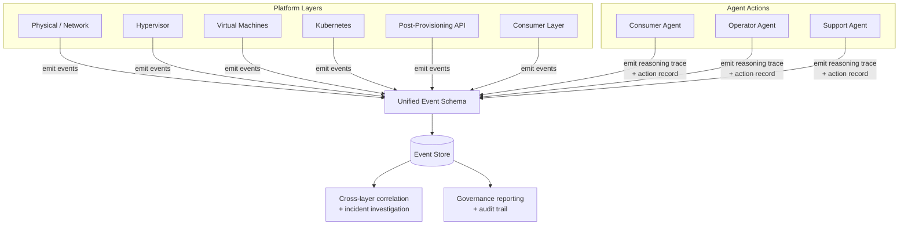

# Agentic Platform Access — Telemetry

The disjointed state of observability today — Datadog here, Prometheus there, logs somewhere else — is workable as a starting point. The investment required is not necessarily tool consolidation. It is a **common event schema** that every layer emits to, so that an agent action can be traced from decision to system state change in a single query.

---

## What Each Layer Needs to Emit

**Physical / network layer**
- Switch and routing health
- Hardware events and failure signals
- Link state changes

**Hypervisor layer**
- Host resource utilization
- VM placement and migration events
- Hypervisor health and version state

**Virtual machine layer**
- Provisioning and deprovisioning events with timestamps and requester identity
- Resource allocation and utilization
- Lifecycle state changes

**Kubernetes / workload layer**
- Cluster health, node pressure, pod scheduling events
- Workload resource consumption
- Deployment and rollout events

**Post-provisioning / API layer**
- Every API call: caller identity, requested action, parameters, outcome, duration
- Job execution records: what ran, on what resource, with what result
- Failed jobs with enough context to diagnose without re-running

**Consumer layer**
- What each team requested, through what path, with what outcome
- Golden path adherence — did the request follow an approved path or was it an exception?
- Quota and policy check results

---

## Agent Action Layer — New, and Critical

This does not exist today and must be built. Every agent action needs a trace that captures:

- What triggered the action (alert, user request, scheduled task)
- What the agent decided to do and why (the reasoning, not just the outcome)
- What API calls it made, in what order
- What the system state was before and after
- Whether a human approval was required and what was decided
- Duration and any retries

This is *reasoning observability*, not just system observability. Without it, you can see that a system state changed. You cannot see why an agent decided to change it, or whether it would make the same decision again given different inputs.

---

## The Unified Event Schema

Each event, regardless of which tool captures it, should carry:

```
timestamp
layer                # physical | hypervisor | vm | kubernetes | api | consumer | agent
actor_type           # human | consumer_agent | operator_agent | support_agent | system
actor_identity       # who or what took the action
resource_id          # what resource was affected
action               # what was done
outcome              # success | failure | partial
blast_radius_scope   # team | cluster | zone | platform
reversible           # true | false
correlation_id       # ties a chain of related events together
```

The tools can be different. The schema has to be the same. This is what makes cross-layer correlation possible — and it is what makes governing agents tractable.

---

## Telemetry Flow



---

## Why Schema Comes Before Agents

If agents operate before the schema is in place, their actions will not be observable in a consistent way. Post-hoc schema adoption is possible but expensive — you will be backfilling observability while agents are already operating, which means a gap in auditability during exactly the period when you most need it.

The schema is a prerequisite, not a follow-on project. Every API layer adopts it before the first agent goes live.
