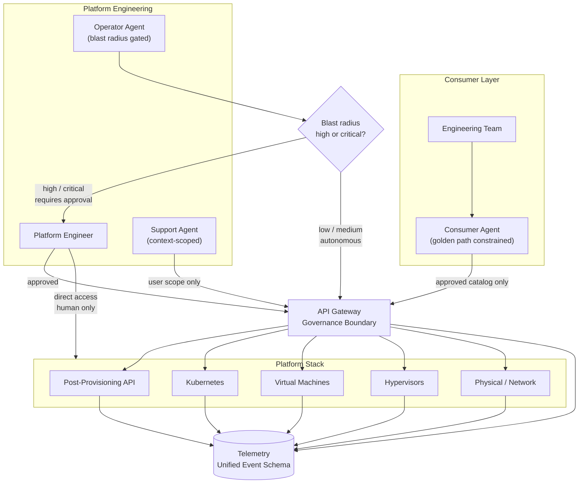

# Agentic Access to Platform Infrastructure

AI agents are not just tools teams build with. They are becoming operators — entities that provision infrastructure, respond to alerts, install software, and support users. The platform has to be designed for this, not retrofitted to it.

This document lays out the prerequisites, the access model, the agent archetypes, the telemetry requirements, and the governance principles for a platform engineering organization where AI operates at every layer of the stack.

- [Prerequisites](#prerequisites)
- [The Stack](#the-stack)
- [The API is the Governance Boundary](#the-api-is-the-governance-boundary)
- [Three Agent Archetypes](#three-agent-archetypes)
- [Access Model Overview](#access-model-overview)
- [Telemetry by Layer](#telemetry-by-layer)
- [Golden Paths](#golden-paths)
- [Governance Model](#governance-model)
- [Industry Best Practices: Four Things This Platform Needs](#industry-best-practices-four-things-this-platform-needs)
- [Possible Solution Shapes](#possible-solution-shapes)
- [What to Build First](#what-to-build-first)

---

## Prerequisites

These are not nice-to-haves. Agents operating without them are not governed — they are unsupervised. Each one is a hard dependency for safe agentic access at any layer of the stack.

---

### 1. Clear product definition

The platform needs a clear, written definition of what it is, what it offers, and where its boundaries are. Without this, there is no basis for defining what agents are permitted to do, what consumers can request, or what falls outside the platform entirely.

This means: what services are offered, at what SLA, with what constraints, and what is explicitly not the platform's responsibility.

---

### 2. APIs abstracting each layer

Every layer of the stack must have an API surface before agents can safely interact with it. Not partial coverage — every action that an agent might take needs to be reachable through a controlled, authenticated, observable API call.

Direct access paths (SSH, console, out-of-band management) become human-only by policy once agents are in play. If an action cannot be taken through the API, agents cannot take it.

This is the foundation everything else is built on.

---

### 3. Shared responsibility model

A clear, written delineation of what the platform owns and what the consumer owns. This governs where agent authority ends and consumer responsibility begins — and it is the document you point to when that line is disputed.

At minimum it defines: who is responsible for what breaks, who owns configuration at each layer, and what the platform guarantees vs. what the consumer is responsible for operating correctly.

Without this, agents will be asked to take actions that are ambiguously owned, and there will be no principled way to say no.

---

### 4. Definition of done

For every agent action type, a definition of what "done" means — not just that the API call succeeded, but what system state constitutes a successful outcome, and what state constitutes a failure requiring remediation.

This is what agents use to determine whether to proceed, retry, or escalate. Without it, an agent that gets an API success response cannot know whether the actual outcome is correct.

---

### 5. Agent identity and credential model

Agent credentials are not human credentials. Before any agent touches an API, the following must be defined:

- How agent credentials are issued and to whom
- How credentials are scoped — what an agent can authenticate as does not mean it can do everything that credential theoretically allows
- How credentials are rotated — agents operating with long-lived, unrotated credentials are a standing risk
- How credentials are revoked — when an agent behaves unexpectedly, you must be able to cut its access immediately without affecting human operators

An agent credential that is too broad, or that cannot be revoked quickly, is a blast radius problem before a single action has been taken.

---

### 6. Agent authorization model

Identity tells you who the agent is. Authorization tells you what it is permitted to do. These are separate systems.

The authorization model needs to define, per agent archetype and per team context:

- What actions are in scope
- What resources can be touched
- What parameters are allowed
- What is explicitly denied regardless of identity

This is the enforcement mechanism behind the golden path catalog. Without it, the catalog is documentation. With it, the catalog is a policy.

---

### 7. Common event schema ratified and adopted

The telemetry schema described in this document needs to exist, be agreed upon, and be adopted by every API layer before agents go live. Not after.

If agents operate before the schema is in place, their actions will not be observable in a consistent way. Post-hoc schema adoption is possible but expensive — you will be backfilling observability while agents are already operating, which means a gap in auditability during exactly the period when you most need it.

The schema is a prerequisite, not a follow-on project.

---

### 8. Blast radius classification for every cataloged action

The governance tiers (low / medium / high / critical) only work if every action in the golden path catalog has been classified before agents begin using it. Without this, the governance model has no input data and every decision either defaults to autonomous (unsafe) or defaults to human approval (useless).

Classification does not need to be perfect on day one — it needs to be conservative. Actions that have not been classified default to the highest tier until reviewed.

---

### 9. Incident response and rollback procedures for agent-caused changes

Before agents operate, you need defined answers to:

- How do you detect that an agent caused an incident?
- How do you stop an agent's actions in flight?
- How do you reverse what it did?
- Who is responsible for the remediation — the platform team or the consuming team?

This must exist before the first agent is deployed, not after the first incident. The absence of a rollback procedure is not a gap you discover safely.

---

### 10. Escalation paths and on-call ownership defined

Every human-in-the-loop gate needs somewhere to route. Before agents operate:

- Who approves high blast radius operator agent actions, at any hour?
- Who does the support agent escalate to when it cannot resolve an issue?
- Who is the on-call owner for agent-caused incidents at each layer?

If these paths are undefined, the human gates become bottlenecks or get bypassed. The escalation model is not a process question — it is a prerequisite for the governance model to function.

---


The platform is not one thing. It is a set of distinct layers, each with different operators, different blast radii, and different governance requirements.

```
┌─────────────────────────────────────────────────────┐
│               Consumer-facing layer                 │
│   Teams consuming VMs, Kubernetes, software         │
├─────────────────────────────────────────────────────┤
│            Post-provisioning / API layer            │
│   Software installation, job execution, golden paths│
├─────────────────────────────────────────────────────┤
│              Kubernetes / workload layer            │
│   Cluster management, workload scheduling           │
├─────────────────────────────────────────────────────┤
│               Virtual machine layer                 │
│   VM lifecycle, resource allocation                 │
├─────────────────────────────────────────────────────┤
│                  Hypervisor layer                   │
│   Compute virtualization, host management           │
├─────────────────────────────────────────────────────┤
│            Physical / network layer                 │
│   Switches, routing, physical hardware              │
├─────────────────────────────────────────────────────┤
│         Telemetry / observability layer             │
│   Cuts across every layer — metrics, logs, traces,  │
│   and agent action records                          │
└─────────────────────────────────────────────────────┘
```

The telemetry layer is not at the top or the bottom. It runs through everything. It is the prerequisite for governing everything above it.

---

## The API is the Governance Boundary

Before anything else: every agent interaction with the platform — at every layer — must go through a controlled API surface.

This is not primarily about developer convenience. It is about governance. An agent that can SSH directly to a hypervisor, make changes, and leave — with no API call, no event emitted, no audit record — is an agent you do not control. You may have given it access. You have not given yourself visibility.

**The principle:** if an action cannot be taken through the API, it cannot be taken by an agent. The API is not just the interface. It is the perimeter.

Consequences of this:
- Every layer of the stack needs an API surface, even if one does not exist today
- The post-provisioning system is already API-driven — this is the right model to extend
- Direct access paths (SSH, console, out-of-band management) become human-only by policy
- Every API call becomes an auditable, observable event

---

## Three Agent Archetypes

Agents operating on this platform are not one thing. There are three distinct archetypes, each with different scope, trust level, and governance requirements.

### 1. Consumer Agent

**Who it serves:** Engineering teams consuming the platform — requesting VMs, Kubernetes clusters, software installations, running post-provisioning jobs.

**What it can do:**
- Provision resources within approved quotas and configurations
- Rerun post-provisioning jobs
- Install software from the approved catalog
- Query the status of their own resources
- Follow golden paths defined by platform engineering

**What it cannot do:**
- Touch resources owned by another team
- Install software not in the approved catalog
- Modify infrastructure configuration
- Bypass quota or policy controls

**The model:** the consumer agent is a constrained interface. It translates a team's intent into API calls, but only within the scope of what has been approved for that team. The golden path is not a suggestion — it is the boundary of what the agent is permitted to execute.

**The key governance question:** is this team's agent acting within their authorized scope, on their own resources, using approved software? Everything else is denied.

---

### 2. Platform Operator Agent

**Who it serves:** Platform engineering — the team that builds and operates the infrastructure.

**What it can do:**
- Respond to alerts and degraded system states
- Diagnose node, VM, and network issues
- Trigger remediation actions (restart services, drain nodes, reroute traffic)
- Execute runbooks automatically for known failure patterns
- Update configurations across the stack

**What it cannot do:** act autonomously at high blast radius without a human in the loop.

**The model:** the platform operator agent is high-trust and high-consequence. It can move fast on low-blast-radius actions (restart a service, drain a node). It must pause and require human approval for high-blast-radius actions (anything that affects multiple teams, production-class resources, or is irreversible).

**The key governance question:** what is the blast radius of this action, and does it require a human approval gate?

The threshold for human-in-the-loop is not just about risk level — it is also about reversibility. An agent that can make a change and undo it quickly if wrong is lower risk than one making permanent changes, even if the immediate blast radius looks similar.

---

### 3. Support Agent

**Who it serves:** Any user with a device, a broken environment, or a question that would previously have generated a ticket.

**What it can do:**
- Query the state of a user's device or environment
- Attempt known self-healing actions (reinstall an agent, reconfigure a network profile, rotate a credential)
- Escalate to a human with full context already attached — no more "please describe your issue" after a 30-minute diagnosis

**What it cannot do:**
- Make changes to infrastructure outside the requesting user's scope
- Access another user's device or data
- Escalate silently — every escalation includes a full context record

**The model:** the support agent replaces the intake and triage layer of traditional ticketing, not the resolution layer. Its job is to resolve what it can, and to hand off everything else with the context a human needs to close it in one touch.

**The key governance question:** is the action scoped to this user's own environment, and is there a human fallback with full context when the agent cannot resolve it?

---

## Access Model Overview



---

## Telemetry by Layer

The disjointed state of observability today — Datadog here, Prometheus there, logs somewhere else — is workable as a starting point. The investment required is not necessarily tool consolidation. It is a **common event schema** that every layer emits to, so that an agent action can be traced from decision to system state change in a single query.

### What each layer needs to emit

**Physical / network layer**
- Switch and routing health
- Hardware events and failure signals
- Link state changes

**Hypervisor layer**
- Host resource utilization
- VM placement and migration events
- Hypervisor health and version state

**Virtual machine layer**
- Provisioning and deprovisioning events with timestamps and requester identity
- Resource allocation and utilization
- Lifecycle state changes

**Kubernetes / workload layer**
- Cluster health, node pressure, pod scheduling events
- Workload resource consumption
- Deployment and rollout events

**Post-provisioning / API layer**
- Every API call: caller identity, requested action, parameters, outcome, duration
- Job execution records: what ran, on what resource, with what result
- Failed jobs with enough context to diagnose without re-running

**Consumer layer**
- What each team requested, through what path, with what outcome
- Golden path adherence — did the request follow an approved path or was it an exception?
- Quota and policy check results

**Agent action layer — new, and critical**

This does not exist today and must be built. Every agent action needs a trace that captures:

- What triggered the action (alert, user request, scheduled task)
- What the agent decided to do and why (the reasoning, not just the outcome)
- What API calls it made, in what order
- What the system state was before and after
- Whether a human approval was required and what was decided
- Duration and any retries

This is *reasoning observability*, not just system observability. Without it, you can see that a system state changed. You cannot see why an agent decided to change it, or whether it would make the same decision again given different inputs.

### The unified event schema

Each event, regardless of which tool captures it, should carry:

```
timestamp
layer                # physical | hypervisor | vm | kubernetes | api | consumer | agent
actor_type           # human | consumer_agent | operator_agent | support_agent | system
actor_identity       # who or what took the action
resource_id          # what resource was affected
action               # what was done
outcome              # success | failure | partial
blast_radius_scope   # team | cluster | zone | platform
reversible           # true | false
correlation_id       # ties a chain of related events together
```

The tools can be different. The schema has to be the same. This is what makes cross-layer correlation possible — and it is what makes governing agents tractable.

---

## Golden Paths

A golden path is not a documentation page. It is a constrained execution path — a specific sequence of API calls, with specific parameters, against a specific set of approved resources — that is the only path an agent is permitted to take.

**Why this matters for agents:** a human going around the golden path leaves traces, gets noticed, has to explain themselves. An agent given too much access can go around the golden path at scale, cleanly, repeatedly — until something breaks badly enough to be noticed. By then the damage is done.

The golden path is the mechanism that makes consumer agents safe to deploy. The agent is not trusted to make good decisions about what to install or how to configure a cluster. It is trusted to execute approved paths correctly.

**Defining golden paths in practice:**

- Start with what is currently documented as supported and available — that is the catalog
- Every item in the catalog becomes a parameterizable API-backed action
- The consumer agent is scoped to that catalog and nothing else
- Exceptions require a human approval, not agent workarounds

Teams that go around the golden path today will want to go around it through the agent too. The answer is: the agent does not have that access. If the exception is legitimate, it gets reviewed and either added to the catalog or handled by a human.

---

## Governance Model

### Blast radius tiers

Not every action carries the same risk. Governance overhead should match risk, not be applied uniformly.

| Tier | Scope | Examples | Agent authority |
|------|-------|----------|-----------------|
| Low | Single resource, reversible | Restart a service, rerun a job | Autonomous — act and log |
| Medium | Single team's resources, mostly reversible | Reprovision a VM, drain a node | Autonomous with immediate notification |
| High | Multiple teams or irreversible | Change network config, delete storage, modify quotas | Requires human approval before execution |
| Critical | Platform-wide or unrecoverable | Hypervisor changes, switch reconfiguration | Human-only — agents propose, do not execute |

### Human-in-the-loop triggers

An agent must pause and request human approval when:

- The action affects resources owned by more than one team
- The action is irreversible or difficult to reverse
- The action has not been taken in this context before (no prior runbook match)
- The confidence score for the decision falls below a defined threshold
- The action would modify platform-level configuration
- A prior action in the same chain failed

### Auditability requirements

Every agent action must produce a record that answers:

1. Who (or what) initiated this?
2. What did the agent decide to do?
3. What did it actually execute?
4. What was the state before and after?
5. Was a human involved? What did they approve?
6. Can this be undone, and how?

This record is not optional. It is the mechanism by which you can answer "what happened" after an incident, demonstrate compliance, and improve the agent's behavior over time.

---

## Industry Best Practices: Four Things This Platform Needs

The following are not opinions. They are convergent patterns across AWS, Azure, GCP, NIST, OWASP, CISA, and the infrastructure automation ecosystem. Each one addresses a gap in how most platform teams approach agentic access.

---

### 1. Least Agency is not the same as Least Privilege — both are required

**The gap:** This document addresses Least Privilege — scoping what an agent can access. It does not address Least Agency — scoping how much freedom an agent has to *act on that access without checking back*.

An agent can have perfectly scoped credentials and still cause damage by acting too autonomously within that scope. These are different failure modes requiring different controls.

OWASP's Top 10 for Agentic Applications 2026 codifies this distinction explicitly. OWASP LLM06 (Excessive Agency) identifies the risk of granting agents more capability or autonomy than necessary — excessive permissions, excessive functionality, or insufficient human oversight. AWS's Well-Architected Generative AI Lens (GENSEC05-BP01) extends this: for Bedrock Agents, execution roles must be scoped not just by archetype but by *specific prompt context* — an agent performing a specific task gets access to only the resources needed for that task, not everything the archetype is theoretically permitted to touch.

**What to add:**

For every agent archetype, define two separate controls:

- **Least Privilege:** what resources and actions the agent's credentials allow
- **Least Agency:** what the agent is permitted to do autonomously vs. what requires a check-back — defined by action type, blast radius, and confidence threshold

The blast radius tier model in this document governs Least Agency. It needs to be treated as a first-class control, not a governance add-on.

*Sources: [OWASP Top 10 for Agentic Applications 2026](https://genai.owasp.org/resource/owasp-top-10-for-agentic-applications-for-2026/), [AWS Well-Architected Generative AI Lens — GENSEC05-BP01](https://docs.aws.amazon.com/wellarchitected/latest/generative-ai-lens/gensec05-bp01.html)*

---

### 2. Short-lived workload identity is the industry standard — long-lived agent keys are the anti-pattern

**The gap:** The prerequisites section says agent credentials must be scoped and revocable. It does not specify the mechanism. The mechanism matters.

AWS, Azure, GCP, and the CNCF's SPIFFE/SPIRE project have all converged on the same answer: **no long-lived credentials for non-human actors**. Tokens are issued per-workload, short-lived, rotate automatically, and are revoked by removing the identity binding — not by rotating a shared secret. A long-lived agent API key that lives in a CI variable or a config file is the credential equivalent of a standing blast radius.

How the major providers implement this:

| Provider | Mechanism | How it works |
|---|---|---|
| AWS | IAM Roles + STS | Compute resources assume a role; SDK retrieves short-lived tokens from Instance Metadata Service automatically. IAM Roles Anywhere extends this to hybrid workloads via X.509 certificates. |
| Azure | Managed Identities | System-assigned or user-assigned identity per resource; Entra ID issues tokens automatically. Workload Identity Federation extends this to external systems (GitHub Actions, Kubernetes) via OIDC token exchange. |
| GCP | Workload Identity Federation | External OIDC tokens exchanged for short-lived Google OAuth 2.0 tokens via Security Token Service. No service account key files. |
| Cross-platform | SPIFFE / SPIRE | CNCF standard for workload identity. Issues X.509 SVIDs per workload via cryptographic attestation — verifying *what* a workload is before issuing a credential. Federates into AWS, Azure, and GCP. |

For this platform: agent identities should be workload-bound, not secret-based. Where the post-provisioning API and platform layers currently use long-lived keys for automation, the path forward is to replace them with short-lived tokens tied to attested workload identity.

NIST SP 800-207 (Zero Trust Architecture) mandates that machine identity posture — not just network position — drives access decisions. An agent credential that cannot be traced to a specific, attested workload is not sufficient.

*Sources: [AWS IAM Roles Anywhere](https://aws.amazon.com/iam/roles-anywhere/), [Azure Managed Identities](https://learn.microsoft.com/en-us/entra/identity/managed-identities-azure-resources/overview), [GCP Workload Identity Federation](https://cloud.google.com/iam/docs/workload-identity-federation), [SPIFFE](https://spiffe.io/docs/latest/spiffe-about/overview/), [NIST SP 800-207](https://csrc.nist.gov/pubs/sp/800/207/final)*

---

### 3. Policy-as-code is the enforcement layer between policy and reality

**The gap:** This document describes a golden path catalog and an authorization model. It does not describe the mechanism that makes them enforced rather than advisory.

Documentation of what agents are permitted to do is not a control. Policy-as-code is. The industry has converged on evaluating proposed actions against policy *before execution* — at the plan phase, not after. The tools vary by environment:

| Tool | Where it enforces | Enforcement model |
|---|---|---|
| **HashiCorp Sentinel** | Terraform Cloud / Enterprise | Hard-mandatory (cannot be bypassed), Soft-mandatory (override requires named approval + audit record), Advisory. Evaluates the Terraform *plan* — proposed state, not current state. |
| **OPA / Gatekeeper** | Kubernetes admission control, Terraform via Conftest, any API | Rego policies evaluated at request time. Blocks non-compliant resource creation at the Kubernetes API server before the object is written. |
| **AWS Service Control Policies** | All IAM actions in an AWS Organization | Define the maximum available permissions — no IAM policy in the org can grant what an SCP denies. |
| **Azure Policy** | All ARM deployments | Deny, audit, or modify resources at creation time, regardless of who or what is deploying. |
| **GCP Organization Policy** | All GCP resource operations | Constraints applied at project/folder/org level, evaluated before any resource is created or modified. |

For this platform, the golden path catalog needs a policy-as-code enforcement layer. Without it, the catalog describes the path but does not prevent agents from taking a different one. The pattern: every agent action passes through a policy check against the catalog before execution. Actions not in the catalog are denied at the policy layer, not at the agent layer.

Port and Backstage both implement this model for developer self-service: engineers request actions through a governed interface, the interface enforces what is permitted, and the underlying infrastructure APIs are not directly accessible. The same model applies to agents.

*Sources: [HashiCorp Sentinel](https://developer.hashicorp.com/terraform/tutorials/cloud-get-started/policy-quickstart), [OPA with Terraform](https://spacelift.io/blog/open-policy-agent-opa-terraform), [AWS SCPs](https://docs.aws.amazon.com/organizations/latest/userguide/orgs_manage_policies_scps.html), [Azure Policy](https://learn.microsoft.com/en-us/azure/governance/policy/overview), [GCP Organization Policy](https://cloud.google.com/resource-manager/docs/organization-policy/overview), [Port Self-Service Actions](https://www.port.io/guide/developer-self-service-actions)*

---

### 4. Prompt injection is an infrastructure-level attack vector

**The gap:** This document treats agents as controlled actors operating within a defined scope. It does not address the attack surface of the agent's *inputs*.

OWASP ASI01 (Agent Goal Hijack) is the highest-ranked risk in the 2026 Agentic Top 10. The attack: an agent that reads external content — a support ticket, a runbook, an API response, a log entry, a user-submitted configuration — can have its objectives redirected by content crafted to look like a legitimate instruction. A support agent that reads a malicious ticket and executes infrastructure commands is not hypothetical. It is the agentic equivalent of command injection, and the blast radius is infrastructure-level.

CISA's April 2024 joint guidance (*Deploying AI Systems Securely*, co-authored with NSA, FBI, NCSC-UK, CCCS, ASD ACSC, NCSC-NZ) specifically calls out prompt injection and indirect context manipulation as attack surfaces for agentic AI deployments.

This creates a class of risk that traditional automation does not have. A Terraform run cannot be redirected by the contents of a ticket. An agent can.

**Controls to add:**

- **Input validation at the agent boundary.** Every external input to an agent — tickets, API responses, user messages, runbook content — is treated as untrusted until parsed and validated. Agents do not execute instructions found in external content; they extract structured data from it and act on that.
- **Separation between agent reasoning context and agent action context.** An agent can read a ticket to understand a problem. It should not treat the ticket as a source of executable instructions. The action set available to the agent is defined by its authorization model, not by the content it processes.
- **Output validation before execution.** Before an agent-generated action is submitted to the API, it is validated against the golden path catalog and blast radius tier. An action that was not in scope when the agent was invoked cannot become in scope because of something the agent read.
- **Audit of agent reasoning inputs.** The agent action log must record not just what the agent did but what inputs it was processing when it made that decision. This is what makes post-incident investigation tractable — and what makes prompt injection attacks detectable.

*Sources: [OWASP Top 10 for Agentic Applications 2026 — ASI01](https://genai.owasp.org/resource/owasp-top-10-for-agentic-applications-for-2026/), [CISA: Deploying AI Systems Securely (April 2024)](https://www.cisa.gov/news-events/alerts/2024/04/15/joint-guidance-deploying-ai-systems-securely), [OWASP Top 10 for LLM Applications 2025 — LLM06 Excessive Agency](https://genai.owasp.org/resource/owasp-top-10-for-llm-applications-2025/)*

---

## Possible Solution Shapes

These are not prescriptions. They are patterns worth evaluating against the current state of the platform.

**API gateway with agent identity**
A dedicated API gateway layer that authenticates agent requests separately from human requests — with agent-specific rate limits, scope restrictions, and automatic event emission. Agents get a different credential class than humans, scoped to what they are permitted to do.

**Golden path catalog as a service**
A machine-readable catalog of approved actions, parameters, and constraints. The consumer agent queries it to know what it can do. Platform engineering owns the catalog. New entries go through a lightweight review. The catalog is the governance layer made executable.

**Unified agent action log**
A dedicated event store for agent actions, separate from but linked to system telemetry. Every agent — consumer, operator, support — writes to it. Every record follows the common schema. Queryable across layers. The source of truth for what agents did and why.

**Human-in-the-loop approval service**
A lightweight service that agents call when an action exceeds their autonomous authority. It routes the approval request to the right person, captures the decision, and returns a signed approval token the agent presents when executing. Creates an auditable chain from decision to action.

**Support agent with context handoff**
A support agent that handles intake and triage but — critically — packages full context before escalating. When a human picks up the ticket, they have the device state, the steps the agent already tried, the outcome of each, and the agent's assessment. No cold starts.

---

## What to Build First

The sequencing matters. Some of these require others to exist first.

**Foundation (required before agents can operate safely):**
1. Common event schema defined and adopted by every API layer
2. Agent identity and credential separation from human access
3. Blast radius tier classification for every action type

**Consumer path (highest leverage, lowest risk):**
4. Golden path catalog as machine-readable API
5. Consumer agent scoped to that catalog
6. Consumer agent action log feeding the unified schema

**Operator path (high leverage, higher risk — build after foundation is solid):**
7. Human-in-the-loop approval service
8. Operator agent with blast radius controls
9. Runbook library that agent can execute against known failure patterns

**Support path (parallel track, relatively self-contained):**
10. Support agent with device state query access
11. Context-packaged escalation to human queue

---

## The Principle Underneath All of This

The goal is not to automate everything. The goal is to make every action — human or agent — observable, attributable, and governable.

Agents that operate invisibly are not assets. They are risk that has not surfaced yet. The platform investment in agentic access is not primarily in the agents themselves. It is in the telemetry, the API surface, and the governance model that make it safe to let them operate.

Build the governance layer first. Then expand what agents are permitted to do inside it.
