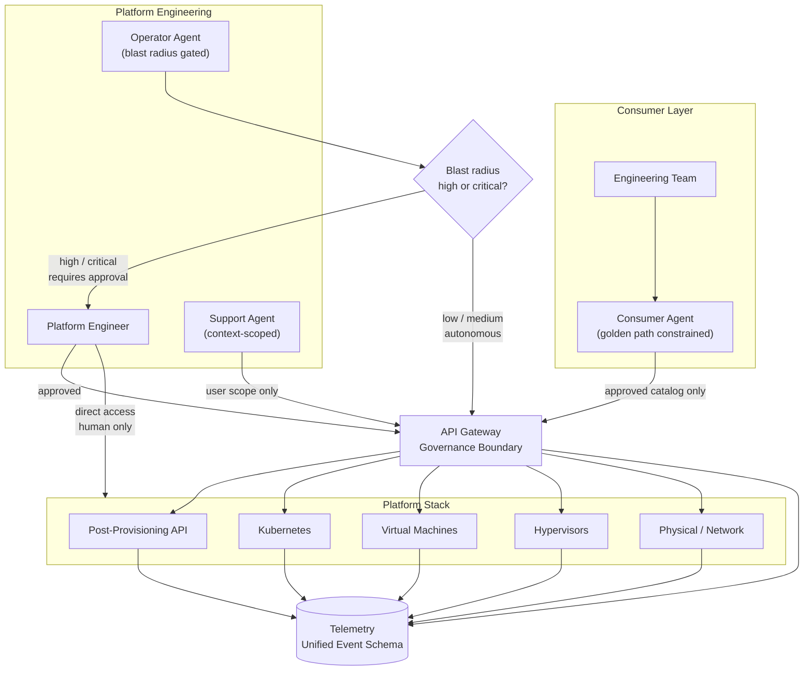

# Agentic Access to Platform Infrastructure

AI agents are not just tools teams build with. They are becoming operators — entities that provision infrastructure, respond to alerts, install software, and support users. The platform has to be designed for this, not retrofitted to it.

This document lays out the access model, the agent archetypes, the telemetry requirements, and the governance principles for a platform engineering organization where AI operates at every layer of the stack.

---

## The Stack

The platform is not one thing. It is a set of distinct layers, each with different operators, different blast radii, and different governance requirements.

```
┌─────────────────────────────────────────────────────┐
│               Consumer-facing layer                 │
│   Teams consuming VMs, Kubernetes, software         │
├─────────────────────────────────────────────────────┤
│            Post-provisioning / API layer            │
│   Software installation, job execution, golden paths│
├─────────────────────────────────────────────────────┤
│              Kubernetes / workload layer            │
│   Cluster management, workload scheduling           │
├─────────────────────────────────────────────────────┤
│               Virtual machine layer                 │
│   VM lifecycle, resource allocation                 │
├─────────────────────────────────────────────────────┤
│                  Hypervisor layer                   │
│   Compute virtualization, host management           │
├─────────────────────────────────────────────────────┤
│            Physical / network layer                 │
│   Switches, routing, physical hardware              │
├─────────────────────────────────────────────────────┤
│         Telemetry / observability layer             │
│   Cuts across every layer — metrics, logs, traces,  │
│   and agent action records                          │
└─────────────────────────────────────────────────────┘
```

The telemetry layer is not at the top or the bottom. It runs through everything. It is the prerequisite for governing everything above it.

---

## The API is the Governance Boundary

Before anything else: every agent interaction with the platform — at every layer — must go through a controlled API surface.

This is not primarily about developer convenience. It is about governance. An agent that can SSH directly to a hypervisor, make changes, and leave — with no API call, no event emitted, no audit record — is an agent you do not control. You may have given it access. You have not given yourself visibility.

**The principle:** if an action cannot be taken through the API, it cannot be taken by an agent. The API is not just the interface. It is the perimeter.

Consequences of this:
- Every layer of the stack needs an API surface, even if one does not exist today
- The post-provisioning system is already API-driven — this is the right model to extend
- Direct access paths (SSH, console, out-of-band management) become human-only by policy
- Every API call becomes an auditable, observable event

---

## Three Agent Archetypes

Agents operating on this platform are not one thing. There are three distinct archetypes, each with different scope, trust level, and governance requirements.

### 1. Consumer Agent

**Who it serves:** Engineering teams consuming the platform — requesting VMs, Kubernetes clusters, software installations, running post-provisioning jobs.

**What it can do:**
- Provision resources within approved quotas and configurations
- Rerun post-provisioning jobs
- Install software from the approved catalog
- Query the status of their own resources
- Follow golden paths defined by platform engineering

**What it cannot do:**
- Touch resources owned by another team
- Install software not in the approved catalog
- Modify infrastructure configuration
- Bypass quota or policy controls

**The model:** the consumer agent is a constrained interface. It translates a team's intent into API calls, but only within the scope of what has been approved for that team. The golden path is not a suggestion — it is the boundary of what the agent is permitted to execute.

**The key governance question:** is this team's agent acting within their authorized scope, on their own resources, using approved software? Everything else is denied.

---

### 2. Platform Operator Agent

**Who it serves:** Platform engineering — the team that builds and operates the infrastructure.

**What it can do:**
- Respond to alerts and degraded system states
- Diagnose node, VM, and network issues
- Trigger remediation actions (restart services, drain nodes, reroute traffic)
- Execute runbooks automatically for known failure patterns
- Update configurations across the stack

**What it cannot do:** act autonomously at high blast radius without a human in the loop.

**The model:** the platform operator agent is high-trust and high-consequence. It can move fast on low-blast-radius actions (restart a service, drain a node). It must pause and require human approval for high-blast-radius actions (anything that affects multiple teams, production-class resources, or is irreversible).

**The key governance question:** what is the blast radius of this action, and does it require a human approval gate?

The threshold for human-in-the-loop is not just about risk level — it is also about reversibility. An agent that can make a change and undo it quickly if wrong is lower risk than one making permanent changes, even if the immediate blast radius looks similar.

---

### 3. Support Agent

**Who it serves:** Any user with a device, a broken environment, or a question that would previously have generated a ticket.

**What it can do:**
- Query the state of a user's device or environment
- Attempt known self-healing actions (reinstall an agent, reconfigure a network profile, rotate a credential)
- Escalate to a human with full context already attached — no more "please describe your issue" after a 30-minute diagnosis

**What it cannot do:**
- Make changes to infrastructure outside the requesting user's scope
- Access another user's device or data
- Escalate silently — every escalation includes a full context record

**The model:** the support agent replaces the intake and triage layer of traditional ticketing, not the resolution layer. Its job is to resolve what it can, and to hand off everything else with the context a human needs to close it in one touch.

**The key governance question:** is the action scoped to this user's own environment, and is there a human fallback with full context when the agent cannot resolve it?

---

## Access Model Overview



---

## Telemetry by Layer

The disjointed state of observability today — Datadog here, Prometheus there, logs somewhere else — is workable as a starting point. The investment required is not necessarily tool consolidation. It is a **common event schema** that every layer emits to, so that an agent action can be traced from decision to system state change in a single query.

### What each layer needs to emit

**Physical / network layer**
- Switch and routing health
- Hardware events and failure signals
- Link state changes

**Hypervisor layer**
- Host resource utilization
- VM placement and migration events
- Hypervisor health and version state

**Virtual machine layer**
- Provisioning and deprovisioning events with timestamps and requester identity
- Resource allocation and utilization
- Lifecycle state changes

**Kubernetes / workload layer**
- Cluster health, node pressure, pod scheduling events
- Workload resource consumption
- Deployment and rollout events

**Post-provisioning / API layer**
- Every API call: caller identity, requested action, parameters, outcome, duration
- Job execution records: what ran, on what resource, with what result
- Failed jobs with enough context to diagnose without re-running

**Consumer layer**
- What each team requested, through what path, with what outcome
- Golden path adherence — did the request follow an approved path or was it an exception?
- Quota and policy check results

**Agent action layer — new, and critical**

This does not exist today and must be built. Every agent action needs a trace that captures:

- What triggered the action (alert, user request, scheduled task)
- What the agent decided to do and why (the reasoning, not just the outcome)
- What API calls it made, in what order
- What the system state was before and after
- Whether a human approval was required and what was decided
- Duration and any retries

This is *reasoning observability*, not just system observability. Without it, you can see that a system state changed. You cannot see why an agent decided to change it, or whether it would make the same decision again given different inputs.

### The unified event schema

Each event, regardless of which tool captures it, should carry:

```
timestamp
layer                # physical | hypervisor | vm | kubernetes | api | consumer | agent
actor_type           # human | consumer_agent | operator_agent | support_agent | system
actor_identity       # who or what took the action
resource_id          # what resource was affected
action               # what was done
outcome              # success | failure | partial
blast_radius_scope   # team | cluster | zone | platform
reversible           # true | false
correlation_id       # ties a chain of related events together
```

The tools can be different. The schema has to be the same. This is what makes cross-layer correlation possible — and it is what makes governing agents tractable.

---

## Golden Paths

A golden path is not a documentation page. It is a constrained execution path — a specific sequence of API calls, with specific parameters, against a specific set of approved resources — that is the only path an agent is permitted to take.

**Why this matters for agents:** a human going around the golden path leaves traces, gets noticed, has to explain themselves. An agent given too much access can go around the golden path at scale, cleanly, repeatedly — until something breaks badly enough to be noticed. By then the damage is done.

The golden path is the mechanism that makes consumer agents safe to deploy. The agent is not trusted to make good decisions about what to install or how to configure a cluster. It is trusted to execute approved paths correctly.

**Defining golden paths in practice:**

- Start with what is currently documented as supported and available — that is the catalog
- Every item in the catalog becomes a parameterizable API-backed action
- The consumer agent is scoped to that catalog and nothing else
- Exceptions require a human approval, not agent workarounds

Teams that go around the golden path today will want to go around it through the agent too. The answer is: the agent does not have that access. If the exception is legitimate, it gets reviewed and either added to the catalog or handled by a human.

---

## Governance Model

### Blast radius tiers

Not every action carries the same risk. Governance overhead should match risk, not be applied uniformly.

| Tier | Scope | Examples | Agent authority |
|------|-------|----------|-----------------|
| Low | Single resource, reversible | Restart a service, rerun a job | Autonomous — act and log |
| Medium | Single team's resources, mostly reversible | Reprovision a VM, drain a node | Autonomous with immediate notification |
| High | Multiple teams or irreversible | Change network config, delete storage, modify quotas | Requires human approval before execution |
| Critical | Platform-wide or unrecoverable | Hypervisor changes, switch reconfiguration | Human-only — agents propose, do not execute |

### Human-in-the-loop triggers

An agent must pause and request human approval when:

- The action affects resources owned by more than one team
- The action is irreversible or difficult to reverse
- The action has not been taken in this context before (no prior runbook match)
- The confidence score for the decision falls below a defined threshold
- The action would modify platform-level configuration
- A prior action in the same chain failed

### Auditability requirements

Every agent action must produce a record that answers:

1. Who (or what) initiated this?
2. What did the agent decide to do?
3. What did it actually execute?
4. What was the state before and after?
5. Was a human involved? What did they approve?
6. Can this be undone, and how?

This record is not optional. It is the mechanism by which you can answer "what happened" after an incident, demonstrate compliance, and improve the agent's behavior over time.

---

## Possible Solution Shapes

These are not prescriptions. They are patterns worth evaluating against the current state of the platform.

**API gateway with agent identity**
A dedicated API gateway layer that authenticates agent requests separately from human requests — with agent-specific rate limits, scope restrictions, and automatic event emission. Agents get a different credential class than humans, scoped to what they are permitted to do.

**Golden path catalog as a service**
A machine-readable catalog of approved actions, parameters, and constraints. The consumer agent queries it to know what it can do. Platform engineering owns the catalog. New entries go through a lightweight review. The catalog is the governance layer made executable.

**Unified agent action log**
A dedicated event store for agent actions, separate from but linked to system telemetry. Every agent — consumer, operator, support — writes to it. Every record follows the common schema. Queryable across layers. The source of truth for what agents did and why.

**Human-in-the-loop approval service**
A lightweight service that agents call when an action exceeds their autonomous authority. It routes the approval request to the right person, captures the decision, and returns a signed approval token the agent presents when executing. Creates an auditable chain from decision to action.

**Support agent with context handoff**
A support agent that handles intake and triage but — critically — packages full context before escalating. When a human picks up the ticket, they have the device state, the steps the agent already tried, the outcome of each, and the agent's assessment. No cold starts.

---

## What to Build First

The sequencing matters. Some of these require others to exist first.

**Foundation (required before agents can operate safely):**
1. Common event schema defined and adopted by every API layer
2. Agent identity and credential separation from human access
3. Blast radius tier classification for every action type

**Consumer path (highest leverage, lowest risk):**
4. Golden path catalog as machine-readable API
5. Consumer agent scoped to that catalog
6. Consumer agent action log feeding the unified schema

**Operator path (high leverage, higher risk — build after foundation is solid):**
7. Human-in-the-loop approval service
8. Operator agent with blast radius controls
9. Runbook library that agent can execute against known failure patterns

**Support path (parallel track, relatively self-contained):**
10. Support agent with device state query access
11. Context-packaged escalation to human queue

---

## The Principle Underneath All of This

The goal is not to automate everything. The goal is to make every action — human or agent — observable, attributable, and governable.

Agents that operate invisibly are not assets. They are risk that has not surfaced yet. The platform investment in agentic access is not primarily in the agents themselves. It is in the telemetry, the API surface, and the governance model that make it safe to let them operate.

Build the governance layer first. Then expand what agents are permitted to do inside it.
